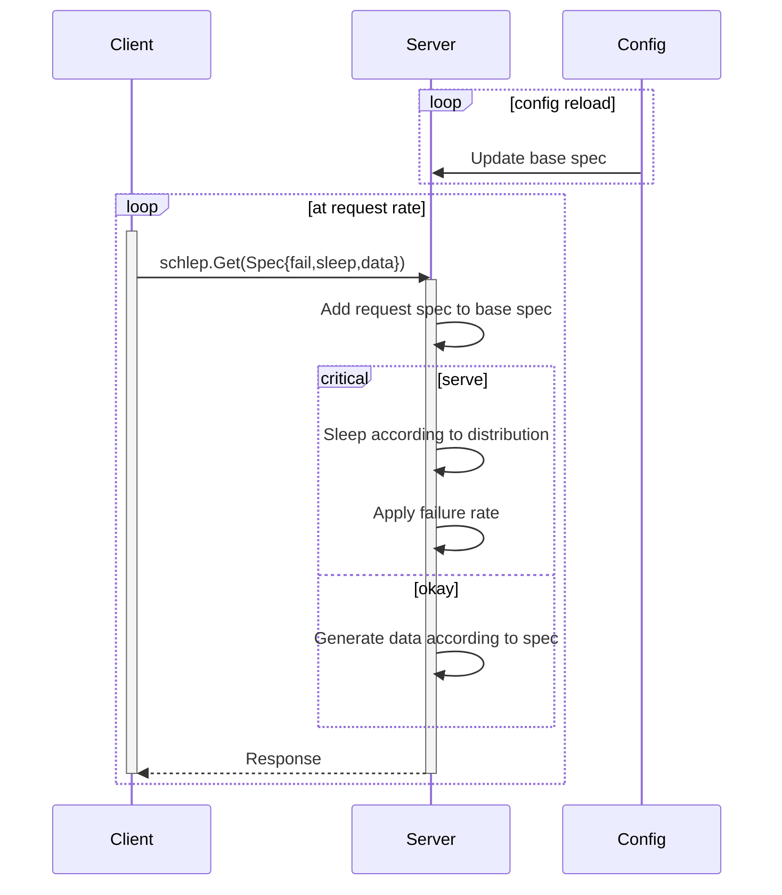
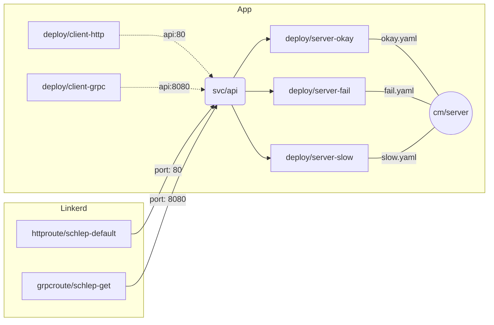

# Schlep: A simple HTTP/2 test app

Schlep is a simple HTTP/2 test application.



## Server

The serves exposes (1) a gRPC service, [`schlep.Schlep`](./proto/schlep.proto),
and (2) an simple `GET` interface on a cleartext, prior-knowledge HTTP/2 server
(a.k.a. _h2c_).

### HTTP API

```shell
:; curl --http2-prior-knowledge 'http://localhost:8080/?fail-rate=0.05&sleep.p50=0.01&sleep.p90=0.1&sleep.p99=1.0&data.p50=10&data.p90=100&data.p99=1000'
```

### Configuration

The server can watch a configuration file for changes. The configuration may be either JSON or YAML and is in the format:

```json
{
    "fail": 0.05,
    "sleep": {
      "p50": 0.01,
      "p90": 0.1,
      "p99": 1.0
    },
    "data": {
      "p50": 10,
      "p90": 100,
      "p99": 1000
    }
}
```

## Client

The client executes requests to the server at a given rate. By default, the
client uses the basic HTTP response scheme. The `--grpc` flag can be used to
enable use of the gRPC API.

## Kubernetes

This repo also includes a set of Kubernetes manifests that can be used to deploy
the application, along with route configuration for Linkerd via the
`gateway.networking.k8s.io` API.



### Quickstart

```shell
:; export PATH=$PATH:/home/code/.linkerd2/bin
:; scurl https://run.linkerd.io/install-edge | bash
:; linkerd check --pre
:; linkerd install --crds | kubectl apply -f -
:; linkerd install | kubectl apply -f -
:; linkerd check
:; kubectl apply -f k8s/ns.yaml
:; kubectl apply -f k8s
```

### Linkerd Configuration

[Linkerd](https://linkerd.io) adds metrics, load balancing, retries, timeouts,
and circuit breaking to the application. The configuration is defined in the
`gateway.networking.k8s.io` API.:

```yaml
apiVersion: gateway.networking.k8s.io/v1alpha2
kind: GRPCRoute
metadata:
  name: schlep-get
  namespace: schlep
  annotations:
    retry.linkerd.io/grpc: internal
    retry.linkerd.io/limit: "2"
    retry.linkerd.io/timeout: 150ms
    timeout.linkerd.io/request: 300ms
# spec: ...
```

Linkerd consumes these route configurations and exports metrics that can be used
to monitor the application behavior:

```shell
:; linkerd diagnostics proxy-metrics -n schlep deploy/client-grpc | grep outbound_grpc_route
```

A set of route-level metricss describe application's view of the traffic:

```text
# HELP outbound_grpc_route_request_duration_seconds The time between request initialization and response completion.
# TYPE outbound_grpc_route_request_duration_seconds histogram
# UNIT outbound_grpc_route_request_duration_seconds seconds
outbound_grpc_route_request_duration_seconds_sum{parent_group="core",parent_kind="Service",parent_namespace="schlep",parent_name="api",parent_port="8080",parent_section_name="",route_group="gateway.networking.k8s.io",route_kind="GRPCRoute",route_namespace="schlep",route_name="api-get"} 280.96408839699998
outbound_grpc_route_request_duration_seconds_count{parent_group="core",parent_kind="Service",parent_namespace="schlep",parent_name="api",parent_port="8080",parent_section_name="",route_group="gateway.networking.k8s.io",route_kind="GRPCRoute",route_namespace="schlep",route_name="api-get"} 7925
outbound_grpc_route_request_duration_seconds_bucket{le="0.05",parent_group="core",parent_kind="Service",parent_namespace="schlep",parent_name="api",parent_port="8080",parent_section_name="",route_group="gateway.networking.k8s.io",route_kind="GRPCRoute",route_namespace="schlep",route_name="api-get"} 6083
outbound_grpc_route_request_duration_seconds_bucket{le="0.5",parent_group="core",parent_kind="Service",parent_namespace="schlep",parent_name="api",parent_port="8080",parent_section_name="",route_group="gateway.networking.k8s.io",route_kind="GRPCRoute",route_namespace="schlep",route_name="api-get"} 7925
outbound_grpc_route_request_duration_seconds_bucket{le="1.0",parent_group="core",parent_kind="Service",parent_namespace="schlep",parent_name="api",parent_port="8080",parent_section_name="",route_group="gateway.networking.k8s.io",route_kind="GRPCRoute",route_namespace="schlep",route_name="api-get"} 7925
outbound_grpc_route_request_duration_seconds_bucket{le="10.0",parent_group="core",parent_kind="Service",parent_namespace="schlep",parent_name="api",parent_port="8080",parent_section_name="",route_group="gateway.networking.k8s.io",route_kind="GRPCRoute",route_namespace="schlep",route_name="api-get"} 7925
outbound_grpc_route_request_duration_seconds_bucket{le="+Inf",parent_group="core",parent_kind="Service",parent_namespace="schlep",parent_name="api",parent_port="8080",parent_section_name="",route_group="gateway.networking.k8s.io",route_kind="GRPCRoute",route_namespace="schlep",route_name="api-get"} 7925
# HELP outbound_grpc_route_request_statuses Completed request-response streams.
# TYPE outbound_grpc_route_request_statuses counter
outbound_grpc_route_request_statuses_total{parent_group="core",parent_kind="Service",parent_namespace="schlep",parent_name="api",parent_port="8080",parent_section_name="",route_group="gateway.networking.k8s.io",route_kind="GRPCRoute",route_namespace="schlep",route_name="api-get",grpc_status="UNKNOWN",error="RESPONSE_HEADERS_TIMEOUT"} 2
outbound_grpc_route_request_statuses_total{parent_group="core",parent_kind="Service",parent_namespace="schlep",parent_name="api",parent_port="8080",parent_section_name="",route_group="gateway.networking.k8s.io",route_kind="GRPCRoute",route_namespace="schlep",route_name="api-get",grpc_status="UNKNOWN",error="REQUEST_TIMEOUT"} 75
outbound_grpc_route_request_statuses_total{parent_group="core",parent_kind="Service",parent_namespace="schlep",parent_name="api",parent_port="8080",parent_section_name="",route_group="gateway.networking.k8s.io",route_kind="GRPCRoute",route_namespace="schlep",route_name="api-get",grpc_status="OK",error=""} 7839
outbound_grpc_route_request_statuses_total{parent_group="core",parent_kind="Service",parent_namespace="schlep",parent_name="api",parent_port="8080",parent_section_name="",route_group="gateway.networking.k8s.io",route_kind="GRPCRoute",route_namespace="schlep",route_name="api-get",grpc_status="INTERNAL",error=""} 9
```

Backend-level metrics describe the actual server behavior:

```text
# HELP outbound_grpc_route_backend_requests The total number of requests dispatched.
# TYPE outbound_grpc_route_backend_requests counter
outbound_grpc_route_backend_requests_total{parent_group="core",parent_kind="Service",parent_namespace="schlep",parent_name="api",parent_port="8080",parent_section_name="",route_group="gateway.networking.k8s.io",route_kind="GRPCRoute",route_namespace="schlep",route_name="api-get",backend_group="core",backend_kind="Service",backend_namespace="schlep",backend_name="api",backend_port="8080",backend_section_name=""} 9088
# HELP outbound_grpc_route_backend_response_duration_seconds The time between request completion and response completion.
# TYPE outbound_grpc_route_backend_response_duration_seconds histogram
# UNIT outbound_grpc_route_backend_response_duration_seconds seconds
outbound_grpc_route_backend_response_duration_seconds_sum{parent_group="core",parent_kind="Service",parent_namespace="schlep",parent_name="api",parent_port="8080",parent_section_name="",route_group="gateway.networking.k8s.io",route_kind="GRPCRoute",route_namespace="schlep",route_name="api-get",backend_group="core",backend_kind="Service",backend_namespace="schlep",backend_name="api",backend_port="8080",backend_section_name=""} 216.70658380999965
outbound_grpc_route_backend_response_duration_seconds_count{parent_group="core",parent_kind="Service",parent_namespace="schlep",parent_name="api",parent_port="8080",parent_section_name="",route_group="gateway.networking.k8s.io",route_kind="GRPCRoute",route_namespace="schlep",route_name="api-get",backend_group="core",backend_kind="Service",backend_namespace="schlep",backend_name="api",backend_port="8080",backend_section_name=""} 9087
outbound_grpc_route_backend_response_duration_seconds_bucket{le="0.025",parent_group="core",parent_kind="Service",parent_namespace="schlep",parent_name="api",parent_port="8080",parent_section_name="",route_group="gateway.networking.k8s.io",route_kind="GRPCRoute",route_namespace="schlep",route_name="api-get",backend_group="core",backend_kind="Service",backend_namespace="schlep",backend_name="api",backend_port="8080",backend_section_name=""} 7141
outbound_grpc_route_backend_response_duration_seconds_bucket{le="0.05",parent_group="core",parent_kind="Service",parent_namespace="schlep",parent_name="api",parent_port="8080",parent_section_name="",route_group="gateway.networking.k8s.io",route_kind="GRPCRoute",route_namespace="schlep",route_name="api-get",backend_group="core",backend_kind="Service",backend_namespace="schlep",backend_name="api",backend_port="8080",backend_section_name=""} 7366
outbound_grpc_route_backend_response_duration_seconds_bucket{le="0.1",parent_group="core",parent_kind="Service",parent_namespace="schlep",parent_name="api",parent_port="8080",parent_section_name="",route_group="gateway.networking.k8s.io",route_kind="GRPCRoute",route_namespace="schlep",route_name="api-get",backend_group="core",backend_kind="Service",backend_namespace="schlep",backend_name="api",backend_port="8080",backend_section_name=""} 8383
outbound_grpc_route_backend_response_duration_seconds_bucket{le="0.25",parent_group="core",parent_kind="Service",parent_namespace="schlep",parent_name="api",parent_port="8080",parent_section_name="",route_group="gateway.networking.k8s.io",route_kind="GRPCRoute",route_namespace="schlep",route_name="api-get",backend_group="core",backend_kind="Service",backend_namespace="schlep",backend_name="api",backend_port="8080",backend_section_name=""} 9087
outbound_grpc_route_backend_response_duration_seconds_bucket{le="0.5",parent_group="core",parent_kind="Service",parent_namespace="schlep",parent_name="api",parent_port="8080",parent_section_name="",route_group="gateway.networking.k8s.io",route_kind="GRPCRoute",route_namespace="schlep",route_name="api-get",backend_group="core",backend_kind="Service",backend_namespace="schlep",backend_name="api",backend_port="8080",backend_section_name=""} 9087
outbound_grpc_route_backend_response_duration_seconds_bucket{le="1.0",parent_group="core",parent_kind="Service",parent_namespace="schlep",parent_name="api",parent_port="8080",parent_section_name="",route_group="gateway.networking.k8s.io",route_kind="GRPCRoute",route_namespace="schlep",route_name="api-get",backend_group="core",backend_kind="Service",backend_namespace="schlep",backend_name="api",backend_port="8080",backend_section_name=""} 9087
outbound_grpc_route_backend_response_duration_seconds_bucket{le="10.0",parent_group="core",parent_kind="Service",parent_namespace="schlep",parent_name="api",parent_port="8080",parent_section_name="",route_group="gateway.networking.k8s.io",route_kind="GRPCRoute",route_namespace="schlep",route_name="api-get",backend_group="core",backend_kind="Service",backend_namespace="schlep",backend_name="api",backend_port="8080",backend_section_name=""} 9087
outbound_grpc_route_backend_response_duration_seconds_bucket{le="+Inf",parent_group="core",parent_kind="Service",parent_namespace="schlep",parent_name="api",parent_port="8080",parent_section_name="",route_group="gateway.networking.k8s.io",route_kind="GRPCRoute",route_namespace="schlep",route_name="api-get",backend_group="core",backend_kind="Service",backend_namespace="schlep",backend_name="api",backend_port="8080",backend_section_name=""} 9087
# HELP outbound_grpc_route_backend_response_statuses Completed responses.
# TYPE outbound_grpc_route_backend_response_statuses counter
outbound_grpc_route_backend_response_statuses_total{parent_group="core",parent_kind="Service",parent_namespace="schlep",parent_name="api",parent_port="8080",parent_section_name="",route_group="gateway.networking.k8s.io",route_kind="GRPCRoute",route_namespace="schlep",route_name="api-get",backend_group="core",backend_kind="Service",backend_namespace="schlep",backend_name="api",backend_port="8080",backend_section_name="",grpc_status="UNKNOWN",error="REQUEST_TIMEOUT"} 75
outbound_grpc_route_backend_response_statuses_total{parent_group="core",parent_kind="Service",parent_namespace="schlep",parent_name="api",parent_port="8080",parent_section_name="",route_group="gateway.networking.k8s.io",route_kind="GRPCRoute",route_namespace="schlep",route_name="api-get",backend_group="core",backend_kind="Service",backend_namespace="schlep",backend_name="api",backend_port="8080",backend_section_name="",grpc_status="UNKNOWN",error="RESPONSE_HEADERS_TIMEOUT"} 563
outbound_grpc_route_backend_response_statuses_total{parent_group="core",parent_kind="Service",parent_namespace="schlep",parent_name="api",parent_port="8080",parent_section_name="",route_group="gateway.networking.k8s.io",route_kind="GRPCRoute",route_namespace="schlep",route_name="api-get",backend_group="core",backend_kind="Service",backend_namespace="schlep",backend_name="api",backend_port="8080",backend_section_name="",grpc_status="INTERNAL",error=""} 610
outbound_grpc_route_backend_response_statuses_total{parent_group="core",parent_kind="Service",parent_namespace="schlep",parent_name="api",parent_port="8080",parent_section_name="",route_group="gateway.networking.k8s.io",route_kind="GRPCRoute",route_namespace="schlep",route_name="api-get",backend_group="core",backend_kind="Service",backend_namespace="schlep",backend_name="api",backend_port="8080",backend_section_name="",grpc_status="OK",error=""} 7839
```

There are also a set of metrics that describe the effects of the retry policy:

```text
# HELP outbound_grpc_route_retry_limit_exceeded Retryable requests not sent due to retry limits.
# TYPE outbound_grpc_route_retry_limit_exceeded counter
outbound_grpc_route_retry_limit_exceeded_total{parent_group="core",parent_kind="Service",parent_namespace="schlep",parent_name="api",parent_port="8080",parent_section_name="",route_group="gateway.networking.k8s.io",route_kind="GRPCRoute",route_namespace="schlep",route_name="api-get"} 11
# HELP outbound_grpc_route_retry_overflow Retryable requests not sent due to circuit breakers.
# TYPE outbound_grpc_route_retry_overflow counter
outbound_grpc_route_retry_overflow_total{parent_group="core",parent_kind="Service",parent_namespace="schlep",parent_name="api",parent_port="8080",parent_section_name="",route_group="gateway.networking.k8s.io",route_kind="GRPCRoute",route_namespace="schlep",route_name="api-get"} 0
# HELP outbound_grpc_route_retry_requests Retry requests emitted.
# TYPE outbound_grpc_route_retry_requests counter5
outbound_grpc_route_retry_requests_total{parent_group="core",parent_kind="Service",parent_namespace="schlep",parent_name="api",parent_port="8080",parent_section_name="",route_group="gateway.networking.k8s.io",route_kind="GRPCRoute",route_namespace="schlep",route_name="api-get"} 1162
# HELP outbound_grpc_route_retry_successes Successful responses to retry requests.
# TYPE outbound_grpc_route_retry_successes counter
outbound_grpc_route_retry_successes_total{parent_group="core",parent_kind="Service",parent_namespace="schlep",parent_name="api",parent_port="8080",parent_section_name="",route_group="gateway.networking.k8s.io",route_kind="GRPCRoute",route_namespace="schlep",route_name="api-get"} 979
```

## Disclaimer

This is demo-ware. It is not intended for production use. There are corner cases
that are not handled well. It works well enough for testing and finding bugs.

# License

This project is licensed under the MIT License - see the [LICENSE](LICENSE) file
for details.
